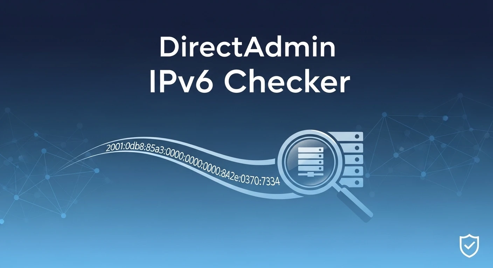

# DirectAdmin IPv6 Checker 🔍

Readme: [EN](README.md)




Este script automatiza a verificação de registros **AAAA (IPv6)** para todos os domínios hospedados em um servidor DirectAdmin. Ele gera um relatório formatado indicando quais domínios já estão operando com a nova versão do protocolo IP.

Certifique-se de ter o utilitário `dnsutils` (que contém o comando `dig`) instalado no seu servidor:

- CentOS/CloudLinux: `yum install bind-utils`
- Debian/Ubuntu: `apt-get install dnsutils`

## 📋 Funcionalidades

- Varre todos os usuários e domínios configurados no DirectAdmin.
- Realiza consultas de DNS em tempo real (via `dig`).
- Gera um relatório tabular limpo em `/var/www/html/ipv6-domains.txt`.
- Identifica rapidamente quais domínios possuem ou não apontamento IPv6.

🚀 Como usar

1. **Baixe o arquivo no servidor:**

```bash
curl -O https://raw.githubusercontent.com/sr00t3d/directadmin-checkipv6/refs/heads/main/da-checkipv6.sh
```

2. **Dê permissão de execução:**

```bash
chmod +x da-checkipv6.sh
```

3. **Execute o script:**

```bash
./da-checkipv6.sh
```

4. Visualização do Resultado

Após a execução, você pode visualizar o relatório diretamente pelo terminal ou via navegador (se o Apache/Nginx estiver rodando):

```bash
cat /var/www/html/ipv6-domains.txt
```

📊 Exemplo de Saída

```bash

./da-checkipv6.sh 
Starting domain verification...
List generated at /var/www/html/ipv6-domains.txt

Domain                                   | AAAA                                    | Using IPv6?
-----------------------------------------------------------------------------------------------
domain1.com.br                           | -                                       | no        
domain2.adv.br                           | -                                       | no        
domain3.org.br                           | -                                       | no        
domain4.com                              | 1446:4700:130:436c:6f75:6466:6c61:7265  | yes     
```

> [!WARNING]
> O script requer permissão de leitura nos diretórios do DirectAdmin (/usr/local/directadmin/data/users/), portanto é recomendado executá-lo como usuário root.

## ⚠️ Aviso Legal

> [!WARNING]
> Este software é fornecido "tal como está". Certifique-se sempre de ter permissão explícita antes de executar. O autor não se responsabiliza por qualquer uso indevido, consequências legais ou impacto nos dados causados ​​por esta ferramenta.

## 📚 Detailed Tutorial

Para um guia completo, passo a passo, confira meu artigo completo:

👉 [**Verificar Domínios Ipv6 no DirectAdmin**](https://perciocastelo.com.br/blog/check-domains-ipv6-on-directAdmin.html)

## Licença 📄

Este projeto está licenciado sob a **GNU General Public License v3.0**. Veja o arquivo [LICENSE](LICENSE) para mais detalhes.